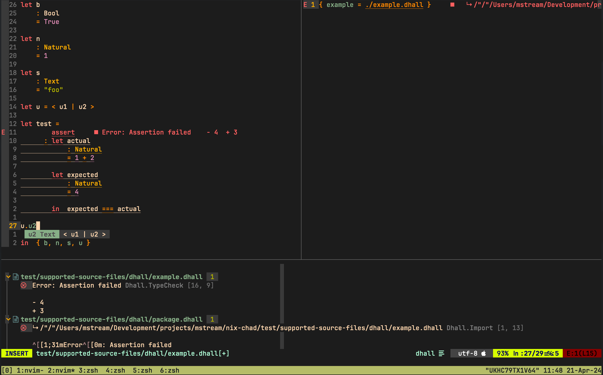

# Nix Chad

[](https://mstream.github.io/nix-chad/)

______________________________________________________________________


An opinionated MacOS setup focused on software development.

## Features

### Neovim

#### programming/configuration languages support



| language   | actions | completion | diagnostics | formatting | highlighting |
| :--------- | :-----: | :--------: | :---------: | :--------: | :----------: |
| bash       |    ☒    |     ☑      |      ☑      |     ☑      |      ☑       |
| dhall      |    ☒    |     ☑      |      ☑      |     ☑      |      ☑       |
| docker     |    ☒    |     ☒      |      ☑      |     ☒      |      ☑       |
| html       |    ☒    |     ☑      |      ☑      |     ☑      |      ☑       |
| java       |    ☒    |     ☑      |      ☑      |     ☑      |      ☑       |
| json       |    ☒    |     ☑      |      ☑      |     ☑      |      ☑       |
| javascript |    ☑    |     ☑      |      ☑      |     ☑      |      ☑       |
| lua        |    ☑    |     ☑      |      ☑      |     ☑      |      ☑       |
| markdown   |    ☑    |     ☑      |      ☑      |     ☑      |      ☑       |
| nix        |    ☒    |     ☑      |      ☑      |     ☑      |      ☑       |
| purescript |    ☑    |     ☑      |      ☑      |     ☑      |      ☑       |
| python     |    ☑    |     ☑      |      ☑      |     ☑      |      ☑       |
| typescript |    ☑    |     ☑      |      ☑      |     ☑      |      ☑       |
| yaml       |    ☑    |     ☒      |      ☑      |     ☑      |      ☑       |

#### discoverable key mappings

After pressing `\` key a window enumerating all key mappings appears.
The same windows shows when user starts but does not finish a key
sequence which has some action assigned to it.

## Prerequisites

- [Nix 2.4+](https://nixos.org/manual/nix/stable/)

## Configuration

### Initializing from a template

Run from a directory of your choice:

```bash
nix flake init --template github:mstream/nix-chad/main#default
```

### Tweaking

Update any config entries to your liking like in
[this](https://github.com/mstream/nix-chad/blob/main/examples/custom/flake.nix) example.

### Applying

After any change to configuration, run from the directory where
`flake.nix` file resides:

```bash
nix run .#switch
```

## Updating

To stay up to date witch changes to Nix Chad, run periodically:

```bash
nix flake update
```
